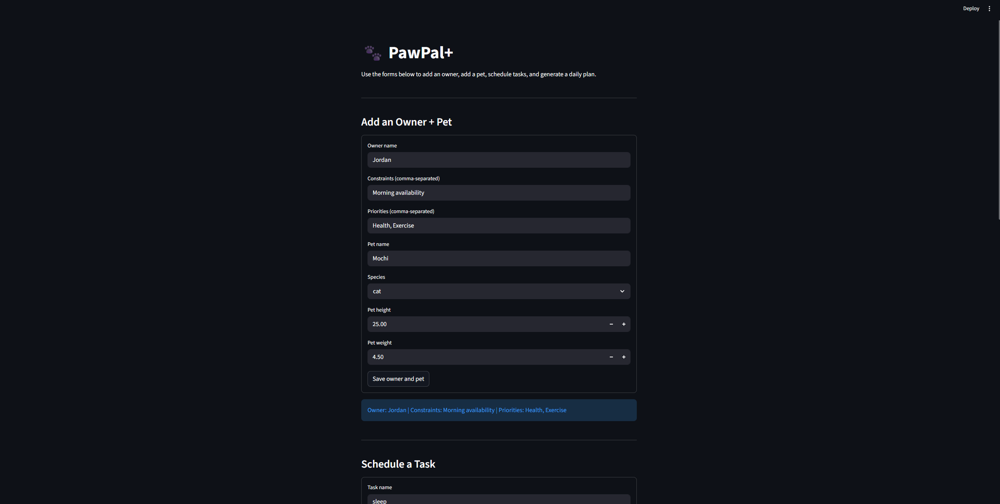
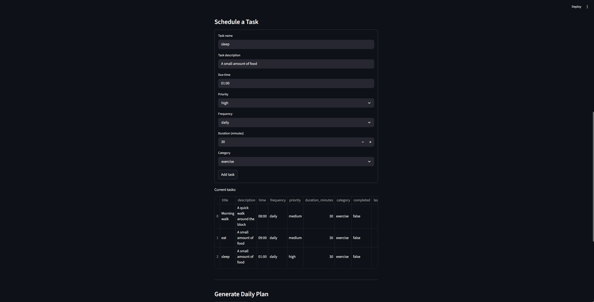
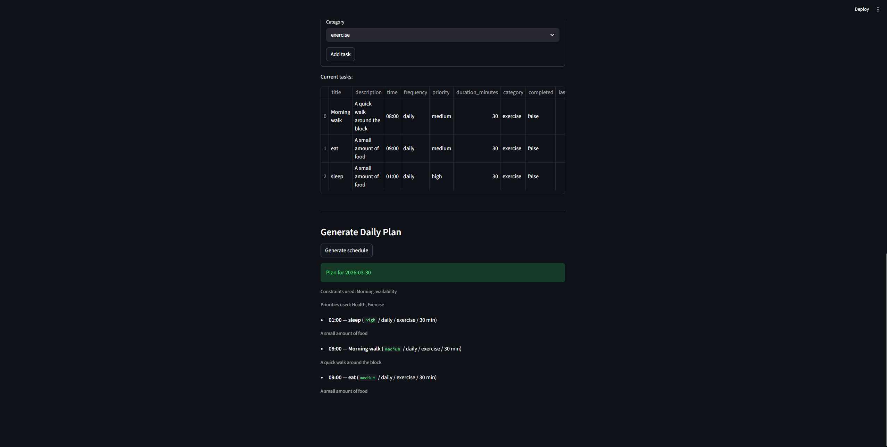

# PawPal+ (Module 2 Project)

You are building **PawPal+**, a Streamlit app that helps a pet owner plan care tasks for their pet.

## Scenario

A busy pet owner needs help staying consistent with pet care. They want an assistant that can:

- Track pet care tasks (walks, feeding, meds, enrichment, grooming, etc.)
- Consider constraints (time available, priority, owner preferences)
- Produce a daily plan and explain why it chose that plan

Your job is to design the system first (UML), then implement the logic in Python, then connect it to the Streamlit UI.

## What you will build

Your final app should:

- Let a user enter basic owner + pet info
- Let a user add/edit tasks (duration + priority at minimum)
- Generate a daily schedule/plan based on constraints and priorities
- Display the plan clearly (and ideally explain the reasoning)
- Include tests for the most important scheduling behaviors

## Smarter Scheduling

Recent improvements make the scheduler more practical for everyday pet care:

- **Recurring task rollover** for `daily` and `weekly` tasks using automatic next occurrences
- **Priority-based tie-breakers** that favor health-related and shorter tasks when times match
- **Lightweight conflict warnings** for tasks scheduled at the same exact time
- **Due-date filtering** so completed or future tasks do not clutter today's plan

## Getting started

### Setup

```bash
python -m venv .venv
source .venv/bin/activate  # Windows: .venv\Scripts\activate
pip install -r requirements.txt
```

### Suggested workflow

1. Read the scenario carefully and identify requirements and edge cases.
2. Draft a UML diagram (classes, attributes, methods, relationships).
3. Convert UML into Python class stubs (no logic yet).
4. Implement scheduling logic in small increments.
5. Add tests to verify key behaviors.
6. Connect your logic to the Streamlit UI in `app.py`.
7. Refine UML so it matches what you actually built.

### Testing PawPal+
python -m pytest
1. confirm task completion with mark_complete()
2. make sure task list grow when new task is added
3. make sure tasks are returned in chronological order and, for same time tasks, use priority, health category, and duration tie breakers.
4. confirms a completed daily/weekly task creates the next occurrence with right features
5. make sure that duplicate task are flagged
6. verifies that "once" tasks do not create duplicate
confidence lever: 4.5/5

### Features/demo
1. Sorting by time
2. Priority tie-breakers
3. Health-first ordering
4. Shorter-task preference
5. Conflict warnings
6. Daily and weekly recurrence rollover
7. Due-date filtering
8. Monthly recurrence support



